# Dimensionality_reduction-for-clustering

# 1. Introduction
- Project context and objective:
  This project aims to investigate whether the use of dimensionality reduction techniques can improve clustering, i.e., achieve better-separated clusters.
# 2. Methodology
- Data used:
  We conducted experiments on both artificial and real data.
- Data normalization:
  Before applying clustering, the data is normalized using StandardScaler from the scikit-learn library in Python.
# 3. Clustering algorithms
- Algorithms used:
  We used four different clustering algorithms:
  - Kmeans
  - Agglomerative Clustering
  - Gaussian Mixture
  - Optics
- Evaluation of the results
  Clustering results are evaluated using the Adjusted Rand Index (ARI) metric, which measures the similarity between two data groupings.
# 4. Dimensionality reduction
- Dimensionality reduction methods
  Several dimensionality reduction methods were applied:
  - Linear methods: PCA (Principal Component Analysis)
  - Non-linear methods: KernelPCA, Isomap, MDS (Multidimensional Scaling)
  - Autoencoders: Classic Autoencoder, Variational Autoencoder, Denoising Autoencoder
- Choice of target dimensions
  The chosen target dimensions for each method are:
  - r = K-1 (where K is the number of clusters)
  - r = 25% of D (where D is the initial dimension of the data)
  - r = 50% of D
# 5. Comparison of results
- Clustering on original data:
  Clustering is first performed on the normalized original data.
- Clustering after dimensionality reduction:
  Once the dimensionality is reduced, clustering is performed again on the data obtained from each dimensionality reduction method.
- Comparison of ARI scores:
  The ARI scores obtained for each dimensionality reduction method are compared with those from the original data to determine which methods improve clustering, i.e., have 
better ARI scores than the data before dimensionality reduction.

# 6. Circles (a)

<table>
  <tr>
    <th></th>
    <th>No Reduction</th>
    <th colspan="3">PCA</th>
    <th colspan="3">KernelPCA</th>
    <th colspan="3">Variational Autoencoder</th>
    <th colspan="3">Isomap</th>
    <th colspan="3">MDS</th>
  </tr>
  <tr>
    <td>Number of features</td>
    <td></td>
    <td>K-1</td>
    <td>25% of D</td>
    <td>50% of D</td>
    <td>K-1</td>
    <td>25% of D</td>
    <td>50% of D</td>
    <td>K-1</td>
    <td>25% of D</td>
    <td>50% of D</td>
    <td>K-1</td>
    <td>25% of D</td>
    <td>50% of D</td>
    <td>K-1</td>
    <td>25% of D</td>
    <td>50% of D</td>
  </tr>
  <tr>
    <td>Kmeans</td>
    <td>0.230</td>
    <td>0.131</td>
    <td>0.230</td>
    <td>0.230</td>
    <td>0.125</td>
    <td>0.211</td>
    <td>0.236</td>
    <td>0.013</td>
    <td>0.233</td>
    <td>0.203</td>
    <td>0.105</td>
    <td>0.173</td>
    <td>0.17</td>
    <td>0.203</td>
    <td>0.168</td>
    <td>0.168</td>
  </tr>
  <tr>
    <td>Agglomerative</td>
    <td>0.058</td>
    <td>0.045</td>
    <td>0.058</td>
    <td>0.073</td>
    <td>0.161</td>
    <td>0.1</td>
    <td>0.125</td>
    <td>0.012</td>
    <td>0.095</td>
    <td>0.122</td>
    <td>0.107</td>
    <td>0.127</td>
    <td>0.136</td>
    <td>0.131</td>
    <td>0.093</td>
    <td>0.038</td>
  </tr>
  <tr>
    <td>Gaussian mixture</td>
    <td>0.163</td>
    <td>0.060</td>
    <td>0.164</td>
    <td>0.164</td>
    <td>0.178</td>
    <td>0.210</td>
    <td>0.205</td>
    <td>0.012</td>
    <td>0.170</td>
    <td>0.296</td>
    <td>0.121</td>
    <td>0.185</td>
    <td>0.186</td>
    <td>0.181</td>
    <td>0.164</td>
    <td>0.164</td>
  </tr>
  <tr>
    <td>Optics</td>
    <td>0.593</td>
    <td>0.163</td>
    <td>0.7</td>
    <td>0.71</td>
    <td>0.118</td>
    <td>0.411</td>
    <td>0.73</td>
    <td>0.008</td>
    <td>0.371</td>
    <td>0.423</td>
    <td>0.205</td>
    <td>0.436</td>
    <td>0.425</td>
    <td>0.368</td>
    <td>0.558</td>
    <td>0.44</td>
  </tr>
</table>

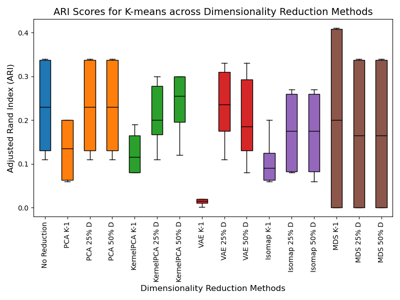
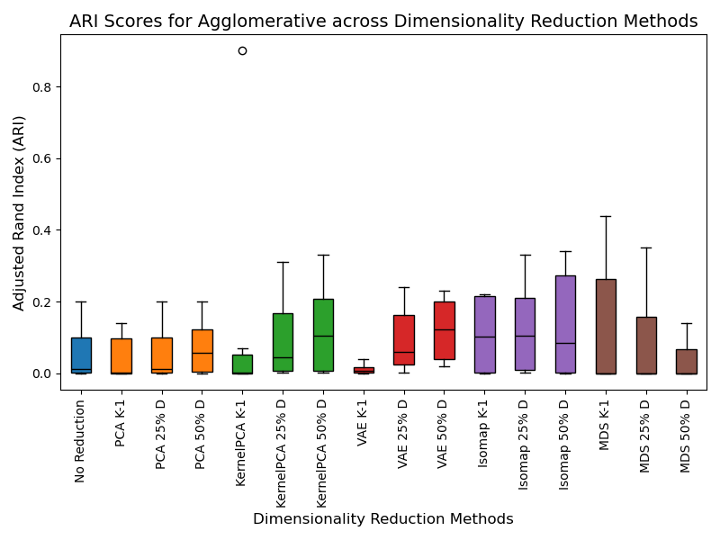
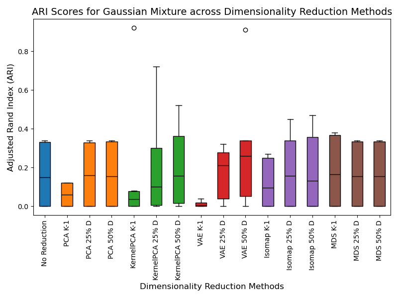
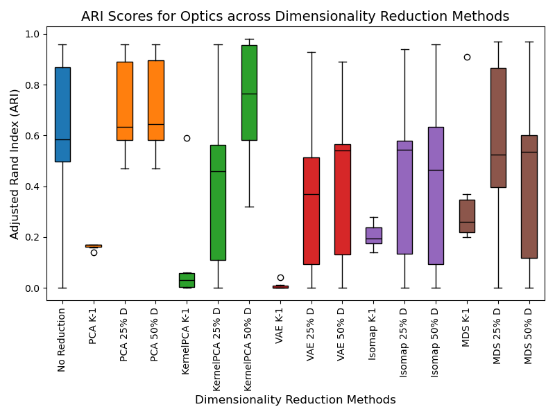

# 7. Moons (b)

<table>
  <tr>
    <th></th>
    <th>No Reduction</th>
    <th colspan="3">PCA</th>
    <th colspan="3">KernelPCA</th>
    <th colspan="3">Variational Autoencoder</th>
    <th colspan="3">Isomap</th>
    <th colspan="3">MDS</th>
  </tr>
  <tr>
    <td>Number of features</td>
    <td></td>
    <td>K-1</td>
    <td>25% of D</td>
    <td>50% of D</td>
    <td>K-1</td>
    <td>25% of D</td>
    <td>50% of D</td>
    <td>K-1</td>
    <td>25% of D</td>
    <td>50% of D</td>
    <td>K-1</td>
    <td>25% of D</td>
    <td>50% of D</td>
    <td>K-1</td>
    <td>25% of D</td>
    <td>50% of D</td>
  </tr>
  <tr>
    <td>Kmeans</td>
    <td>0.535</td>
    <td>0.503</td>
    <td>0.535</td>
    <td>0.535</td>
    <td>0.27</td>
    <td>0.305</td>
    <td>0.303</td>
    <td>0.418</td>
    <td>0.525</td>
    <td>0.39</td>
    <td>0.653</td>
    <td>0.693</td>
    <td>0.686</td>
    <td>0.553</td>
    <td>0.535</td>
    <td>0.536</td>
  </tr>
  <tr>
    <td>Agglomerative</td>
    <td>0.596</td>
    <td>0.47</td>
    <td>0.59</td>
    <td>0.59</td>
    <td>0.583</td>
    <td>0.623</td>
    <td>0.658</td>
    <td>0.45</td>
    <td>0.453</td>
    <td>0.496</td>
    <td>0.495</td>
    <td>0.75</td>
    <td>0.558</td>
    <td>0.526</td>
    <td>0.585</td>
    <td>0.57</td>
  </tr>
  <tr>
    <td>Gaussian mixture</td>
    <td>0.608</td>
    <td>0.451</td>
    <td>0.608</td>
    <td>0.608</td>
    <td>0.581</td>
    <td>0.626</td>
    <td>0.553</td>
    <td>0.378</td>
    <td>0.561</td>
    <td>0.526</td>
    <td>0.64</td>
    <td>0.608</td>
    <td>0.683</td>
    <td>0.506</td>
    <td>0.68</td>
    <td>0.691</td>
  </tr>
  <tr>
    <td>Optics</td>
    <td>0.66</td>
    <td>0.413</td>
    <td>0.66</td>
    <td>0.66</td>
    <td>0.325</td>
    <td>0.698</td>
    <td>0.766</td>
    <td>0.333</td>
    <td>0.478</td>
    <td>0.52</td>
    <td>0.238</td>
    <td>0.398</td>
    <td>0.403</td>
    <td>0.29</td>
    <td>0.314</td>
    <td>0.25</td>
  </tr>
</table>

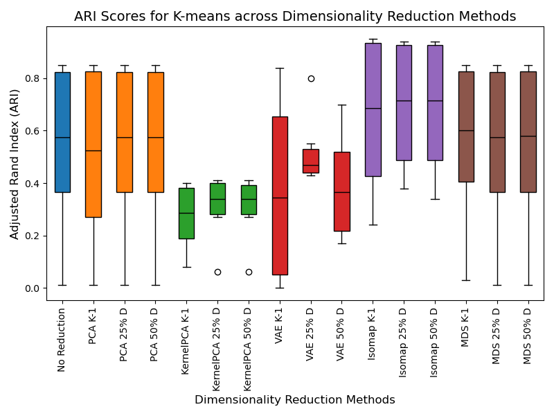
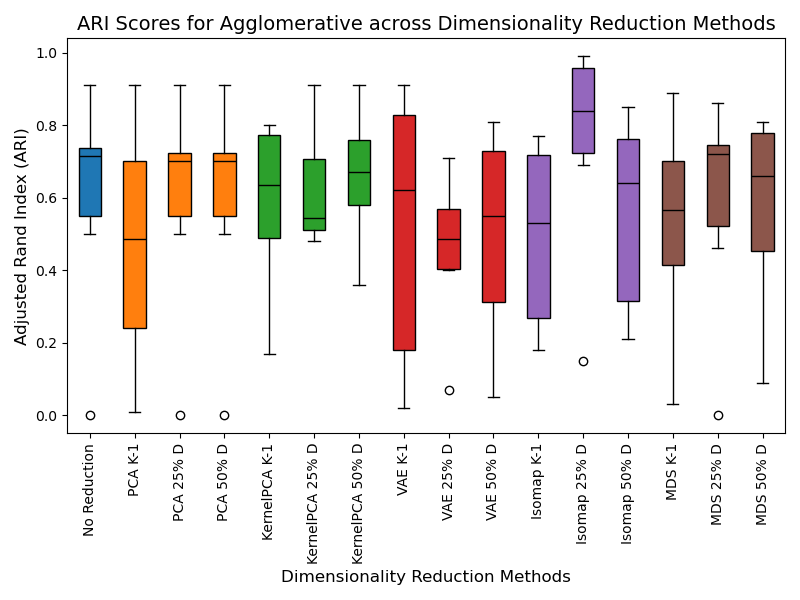
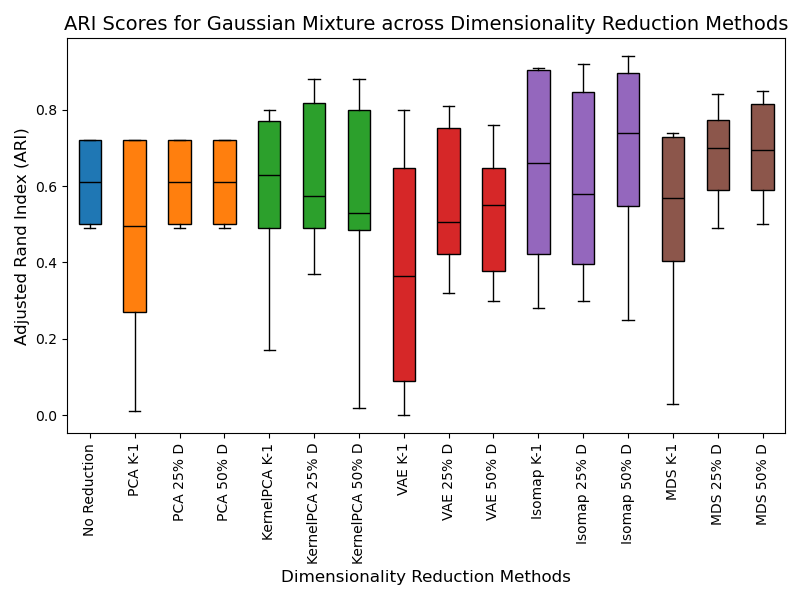
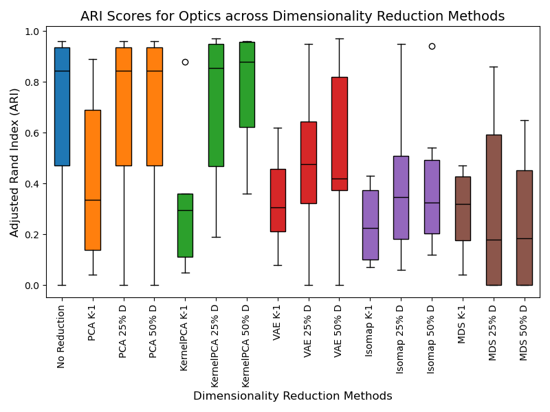

# 8. Moons (b) New

<table>
  <tr>
    <th></th>
    <th>No Reduction</th>
    <th colspan="3">PCA</th>
    <th colspan="3">KernelPCA</th>
    <th colspan="3">Variational Autoencoder</th>
    <th colspan="3">Isomap</th>
    <th colspan="3">MDS</th>
  </tr>
  <tr>
    <td>Number of features</td>
    <td></td>
    <td>K-1</td>
    <td>25% of D</td>
    <td>50% of D</td>
    <td>K-1</td>
    <td>25% of D</td>
    <td>50% of D</td>
    <td>K-1</td>
    <td>25% of D</td>
    <td>50% of D</td>
    <td>K-1</td>
    <td>25% of D</td>
    <td>50% of D</td>
    <td>K-1</td>
    <td>25% of D</td>
    <td>50% of D</td>
  </tr>
  <tr>
    <td>Kmeans</td>
    <td>0.540</td>
    <td></td>
    <td></td>
    <td></td>
    <td></td>
    <td></td>
    <td></td>
    <td></td>
    <td></td>
    <td></td>
    <td></td>
    <td></td>
    <td></td>
    <td></td>
    <td></td>
    <td></td>
  </tr>
  <tr>
    <td>Agglomerative</td>
    <td>0.575</td>
    <td></td>
    <td></td>
    <td></td>
    <td></td>
    <td></td>
    <td></td>
    <td></td>
    <td></td>
    <td></td>
    <td></td>
    <td></td>
    <td></td>
    <td></td>
    <td></td>
    <td></td>
  </tr>
  <tr>
    <td>Gaussian mixture</td>
    <td>0.583</td>
    <td></td>
    <td></td>
    <td></td>
    <td></td>
    <td></td>
    <td></td>
    <td></td>
    <td></td>
    <td></td>
    <td></td>
    <td></td>
    <td></td>
    <td></td>
    <td></td>
    <td></td>
  </tr>
  <tr>
    <td>Optics</td>
    <td>0.298</td>
    <td></td>
    <td></td>
    <td></td>
    <td></td>
    <td></td>
    <td></td>
    <td></td>
    <td></td>
    <td></td>
    <td></td>
    <td></td>
    <td></td>
    <td></td>
    <td></td>
    <td></td>
  </tr>
</table>

# 9. Artificial Data (c)
The table below contains each dimension reduction method's average ARI score values across all artificial datasets.

<table>
  <tr>
    <th></th>
    <th>No Reduction</th>
    <th colspan="3">PCA</th>
    <th colspan="3">KernelPCA</th>
    <th colspan="3">Variational Autoencoder</th>
    <th colspan="3">Isomap</th>
    <th colspan="3">MDS</th>
  </tr>
  <tr>
    <td>Number of features</td>
    <td></td>
    <td>K-1</td>
    <td>25% of D</td>
    <td>50% of D</td>
    <td>K-1</td>
    <td>25% of D</td>
    <td>50% of D</td>
    <td>K-1</td>
    <td>25% of D</td>
    <td>50% of D</td>
    <td>K-1</td>
    <td>25% of D</td>
    <td>50% of D</td>
    <td>K-1</td>
    <td>25% of D</td>
    <td>50% of D</td>
  </tr>
  <tr>
    <td>Kmeans</td>
    <td>0.433</td>
    <td>0.347</td>
    <td>0.390</td>
    <td>0.425</td>
    <td>0.504</td>
    <td>0.511</td>
    <td>0.375</td>
    <td>0.374</td>
    <td>0.531</td>
    <td>0.586</td>
    <td>0.680</td>
    <td>0.646</td>
    <td>0.672</td>
    <td>0.346</td>
    <td>0.437</td>
    <td>0.471</td>
  </tr>
  <tr>
    <td>Agglomerative</td>
    <td>0.587</td>
    <td>0.381</td>
    <td>0.552</td>
    <td>0.624</td>
    <td>0.562</td>
    <td>0.563</td>
    <td>0.620</td>
    <td>0.357</td>
    <td>0.515</td>
    <td>0.563</td>
    <td>0.674</td>
    <td>0.643</td>
    <td>0.684</td>
    <td>0.363</td>
    <td>0.572</td>
    <td>0.625</td>
  </tr>
  <tr>
    <td>Gaussian mixture</td>
    <td>0.423</td>
    <td>0.306</td>
    <td>0.360</td>
    <td>0.406</td>
    <td>0.501</td>
    <td>0.443</td>
    <td>0.443</td>
    <td>0.345</td>
    <td>0.523</td>
    <td>0.330</td>
    <td>0.65</td>
    <td>0.620</td>
    <td>0.641</td>
    <td>0.303</td>
    <td>0.375</td>
    <td>0.395</td>
  </tr>
  <tr>
    <td>Optics</td>
    <td>0.190</td>
    <td>0.102</td>
    <td>0.180</td>
    <td>0.178</td>
    <td>0.190</td>
    <td>0.155</td>
    <td>0.187</td>
    <td>0.145</td>
    <td>0.238</td>
    <td>0.254</td>
    <td>0.308</td>
    <td>0.234</td>
    <td>0.168</td>
    <td>0.084</td>
    <td>0.127</td>
    <td>0.132</td>
  </tr>
</table>

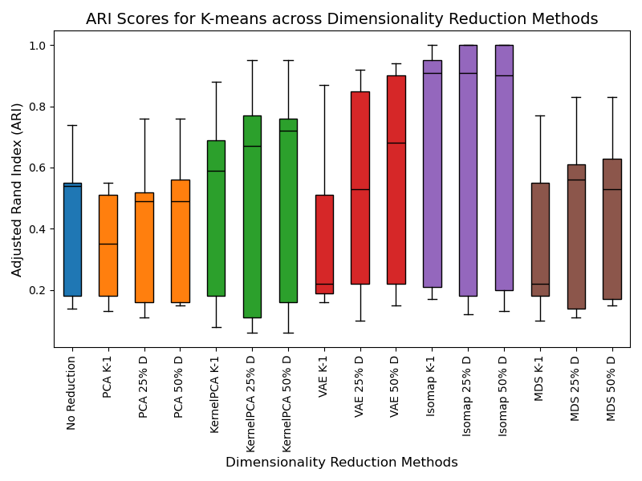
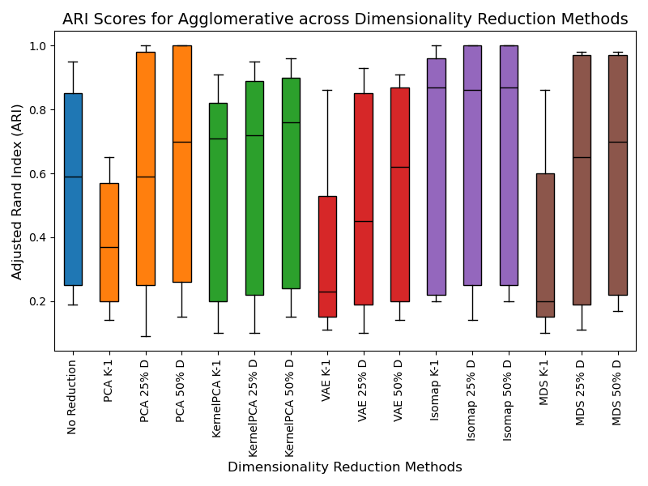
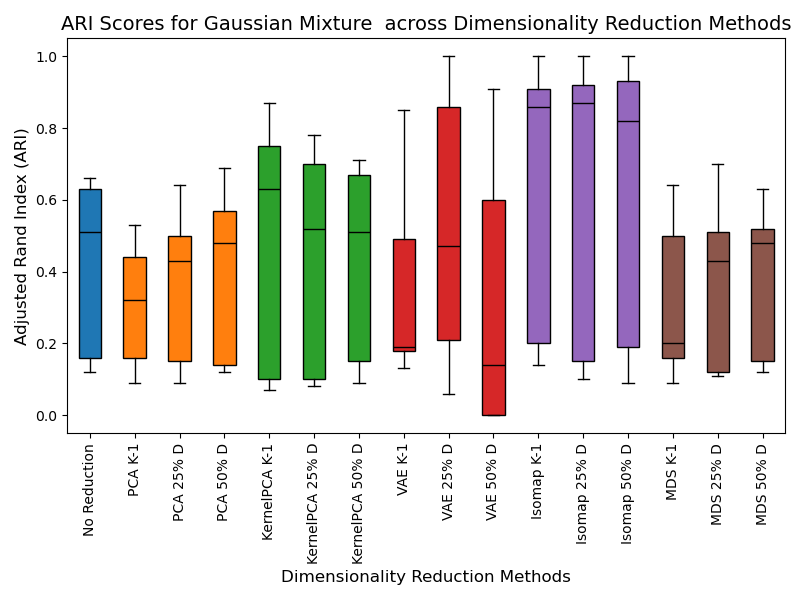
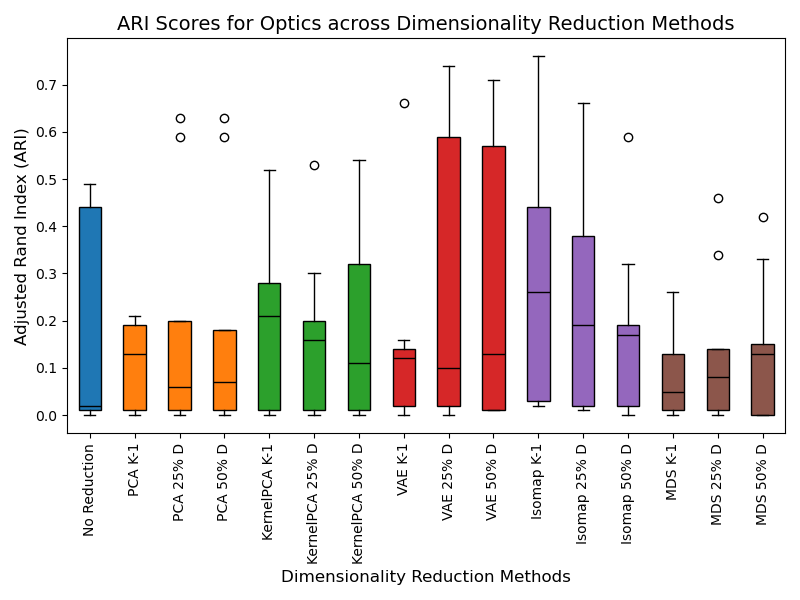

# 10. Repliclust (d)

<table>
  <tr>
    <th></th>
    <th>No Reduction</th>
    <th colspan="3">PCA</th>
    <th colspan="3">KernelPCA</th>
    <th colspan="3">Variational Autoencoder</th>
    <th colspan="3">Isomap</th>
    <th colspan="3">MDS</th>
  </tr>
  <tr>
    <td>Number of features</td>
    <td></td>
    <td>K-1</td>
    <td>25% of D</td>
    <td>50% of D</td>
    <td>K-1</td>
    <td>25% of D</td>
    <td>50% of D</td>
    <td>K-1</td>
    <td>25% of D</td>
    <td>50% of D</td>
    <td>K-1</td>
    <td>25% of D</td>
    <td>50% of D</td>
    <td>K-1</td>
    <td>25% of D</td>
    <td>50% of D</td>
  </tr>
  <tr>
    <td>Kmeans</td>
    <td>0.31</td>
    <td>0.20</td>
    <td>0.31</td>
    <td>0.302</td>
    <td>0.062</td>
    <td>0.11</td>
    <td>0.115</td>
    <td>0.275</td>
    <td>0.272</td>
    <td>0.3</td>
    <td>0.23</td>
    <td>0.317</td>
    <td>0.312</td>
    <td>0.152</td>
    <td>0.27</td>
    <td>0.302</td>
  </tr>
  <tr>
    <td>Agglomerative</td>
    <td>0.407</td>
    <td>0.237</td>
    <td>0.35</td>
    <td>0.32</td>
    <td>0.517</td>
    <td>0.535</td>
    <td>0.562</td>
    <td>0.342</td>
    <td>0.145</td>
    <td>0.117</td>
    <td>0.222</td>
    <td>0.205</td>
    <td>0.25</td>
    <td>0.205</td>
    <td>0.232</td>
    <td>0.375</td>
  </tr>
  <tr>
    <td>Gaussian mixture</td>
    <td>0.432</td>
    <td>0.302</td>
    <td>0.415</td>
    <td>0.435</td>
    <td>0.517</td>
    <td>0.575</td>
    <td>0.595</td>
    <td>0.235</td>
    <td>0.337</td>
    <td>0.39</td>
    <td>0.307</td>
    <td>0.487</td>
    <td>0.54</td>
    <td>0.155</td>
    <td>0.407</td>
    <td>0.44</td>
  </tr>
  <tr>
    <td>Optics</td>
    <td>0.262</td>
    <td>0.125</td>
    <td>0.245</td>
    <td>0.415</td>
    <td>0.267</td>
    <td>0.23</td>
    <td>0.177</td>
    <td>0.102</td>
    <td>0.282</td>
    <td>0.18</td>
    <td>0.142</td>
    <td>0.322</td>
    <td>0.302</td>
    <td>0.21</td>
    <td>0.362</td>
    <td>0.515</td>
  </tr>
</table>

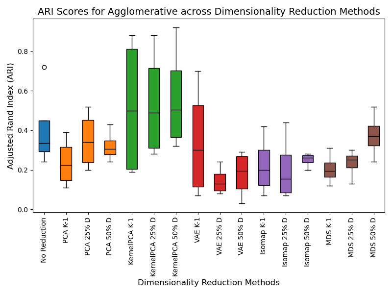
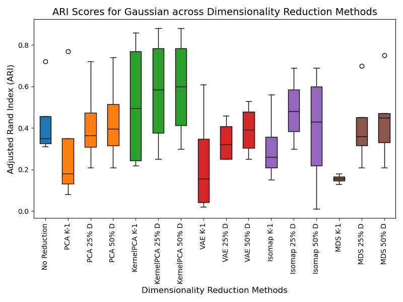
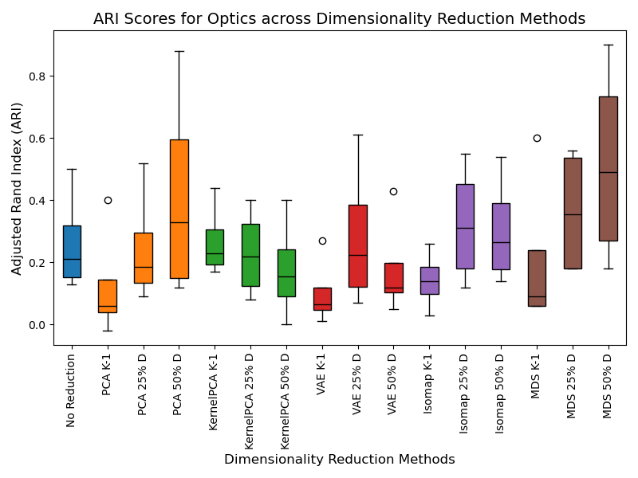

# 11.  Real Data:

- Breast Tissue 
<table>
  <tr>
    <th></th>
    <th>No Reduction</th>
    <th colspan="3">PCA</th>
    <th colspan="3">KernelPCA</th>
    <th colspan="3">Variational Autoencoder</th>
    <th colspan="3">Isomap</th>
    <th colspan="3">MDS</th>
  </tr>
  <tr>
    <td>Number of features</td>
    <td></td>
    <td>K-1</td>
    <td>25% of D</td>
    <td>50% of D</td>
    <td>K-1</td>
    <td>25% of D</td>
    <td>50% of D</td>
    <td>K-1</td>
    <td>25% of D</td>
    <td>50% of D</td>
    <td>K-1</td>
    <td>25% of D</td>
    <td>50% of D</td>
    <td>K-1</td>
    <td>25% of D</td>
    <td>50% of D</td>
  </tr>
  <tr>
    <td>Kmeans</td>
    <td>0.27</td>
    <td>0.29</td>
    <td>0.28</td>
    <td>0.26</td>
    <td>0.19</td>
    <td>0.06</td>
    <td>0.16</td>
    <td>0.27</td>
    <td>0.28</td>
    <td>0.29</td>
    <td>0.3</td>
    <td>0.24</td>
    <td>0.26</td>
    <td>0.27</td>
    <td>0.3</td>
    <td>0.26</td>
  </tr>
  <tr>
    <td>Agglomerative</td>
    <td>0.39</td>
    <td>0.31</td>
    <td>0.32</td>
    <td>0.26</td>
    <td>0.31</td>
    <td>0.47</td>
    <td>0.44</td>
    <td>0.35</td>
    <td>0.23</td>
    <td>0.14</td>
    <td>0.39</td>
    <td>0.4</td>
    <td>0.42</td>
    <td>0.39</td>
    <td>0.4</td>
    <td>0.36</td>
  </tr>
  <tr>
    <td>Gaussian mixture</td>
    <td>0.34</td>
    <td>0.31</td>
    <td>0.29</td>
    <td>0.36</td>
    <td>0.36</td>
    <td>0.36</td>
    <td>0.31</td>
    <td>0.32</td>
    <td>0.32</td>
    <td>0.27</td>
    <td>0.29</td>
    <td>0.23</td>
    <td>0.28</td>
    <td>0.31</td>
    <td>0.27</td>
    <td>0.3</td>
  </tr>
  <tr>
    <td>Optics</td>
    <td>0.25</td>
    <td>0.18</td>
    <td>0.17</td>
    <td>0.23</td>
    <td>0.25</td>
    <td>0.22</td>
    <td>0.2</td>
    <td>0.14</td>
    <td>0.33</td>
    <td>0.33</td>
    <td>0.07</td>
    <td>0.16</td>
    <td>0.07</td>
    <td>0.18</td>
    <td>0.23</td>
    <td>0.18</td>
  </tr>
</table>

- Breast Wisconsin 
<table>
  <tr>
    <th></th>
    <th>No Reduction</th>
    <th colspan="3">PCA</th>
    <th colspan="3">KernelPCA</th>
    <th colspan="3">Variational Autoencoder</th>
    <th colspan="3">Isomap</th>
    <th colspan="3">MDS</th>
  </tr>
  <tr>
    <td>Number of features</td>
    <td></td>
    <td>K-1</td>
    <td>25% of D</td>
    <td>50% of D</td>
    <td>K-1</td>
    <td>25% of D</td>
    <td>50% of D</td>
    <td>K-1</td>
    <td>25% of D</td>
    <td>50% of D</td>
    <td>K-1</td>
    <td>25% of D</td>
    <td>50% of D</td>
    <td>K-1</td>
    <td>25% of D</td>
    <td>50% of D</td>
  </tr>
  <tr>
    <td>Kmeans</td>
    <td>0.67</td>
    <td>0.66</td>
    <td>0.67</td>
    <td>0.67</td>
    <td>0</td>
    <td>0</td>
    <td>0</td>
    <td>0.23</td>
    <td>0.58</td>
    <td>0.64</td>
    <td>0.72</td>
    <td>0.7</td>
    <td>0.71</td>
    <td>0.28</td>
    <td>0.67</td>
    <td>0.67</td>
  </tr>
  <tr>
    <td>Agglomerative</td>
    <td>0.58</td>
    <td>0.59</td>
    <td>0.67</td>
    <td>0.71</td>
    <td>0.65</td>
    <td>0.68</td>
    <td>0.52</td>
    <td>0.49</td>
    <td>0.53</td>
    <td>0.37</td>
    <td>0.72</td>
    <td>0.72</td>
    <td>0.66</td>
    <td>0.25</td>
    <td>0.64</td>
    <td>0.62</td>
  </tr>
  <tr>
    <td>Gaussian mixture</td>
    <td>0.77</td>
    <td>0.69</td>
    <td>0.47</td>
    <td>0.48</td>
    <td>0.65</td>
    <td>0.67</td>
    <td>0.71</td>
    <td>0.33</td>
    <td>0.75</td>
    <td>0.64</td>
    <td>0.76</td>
    <td>0.81</td>
    <td>0.59</td>
    <td>0.16</td>
    <td>0.33</td>
    <td>0.13</td>
  </tr>
  <tr>
    <td>Optics</td>
    <td>0.02</td>
    <td>0.41</td>
    <td>0.02</td>
    <td>0</td>
    <td>0.37</td>
    <td>0</td>
    <td>0</td>
    <td>0.45</td>
    <td>0.02</td>
    <td>0</td>
    <td>0.34</td>
    <td>0</td>
    <td>0</td>
    <td>0.04</td>
    <td>0.02</td>
    <td>0</td>
  </tr>
</table>

- Ecoli

<table>
  <tr>
    <th></th>
    <th>No Reduction</th>
    <th colspan="3">PCA</th>
    <th colspan="3">KernelPCA</th>
    <th colspan="3">Variational Autoencoder</th>
    <th colspan="3">Isomap</th>
    <th colspan="3">MDS</th>
  </tr>
  <tr>
    <td>Number of features</td>
    <td></td>
    <td>K-1</td>
    <td>25% of D</td>
    <td>50% of D</td>
    <td>K-1</td>
    <td>25% of D</td>
    <td>50% of D</td>
    <td>K-1</td>
    <td>25% of D</td>
    <td>50% of D</td>
    <td>K-1</td>
    <td>25% of D</td>
    <td>50% of D</td>
    <td>K-1</td>
    <td>25% of D</td>
    <td>50% of D</td>
  </tr>
  <tr>
    <td>Kmeans</td>
    <td>0.51</td>
    <td>0.51</td>
    <td>0.46</td>
    <td>0.48</td>
    <td>0.51</td>
    <td>0.38</td>
    <td>0.45</td>
    <td>0.51</td>
    <td>0.36</td>
    <td>0.46</td>
    <td>0.51</td>
    <td>0.44</td>
    <td>0.71</td>
    <td>0.51</td>
    <td>0.35</td>
    <td>0.53</td>
  </tr>
  <tr>
    <td>Agglomerative</td>
    <td>0.52</td>
    <td>0.52</td>
    <td>0.44</td>
    <td>0.46</td>
    <td>0.52</td>
    <td>0.41</td>
    <td>0.35</td>
    <td>0.52</td>
    <td>0.26</td>
    <td>0.38</td>
    <td>0.52</td>
    <td>0.53</td>
    <td>0.55</td>
    <td>0.52</td>
    <td>0.56</td>
    <td>0.45</td>
  </tr>
  <tr>
    <td>Gaussian mixture</td>
    <td>0.65</td>
    <td>0.65</td>
    <td>0.39</td>
    <td>0.47</td>
    <td>0.65</td>
    <td>0.33</td>
    <td>0.44</td>
    <td>0.65</td>
    <td>0.47</td>
    <td>0.43</td>
    <td>0.65</td>
    <td>0.45</td>
    <td>0.52</td>
    <td>0.65</td>
    <td>0.49</td>
    <td>0.64</td>
  </tr>
  <tr>
    <td>Optics</td>
    <td>0.31</td>
    <td>0.31</td>
    <td>0.42</td>
    <td>0.29</td>
    <td>0.31</td>
    <td>0.49</td>
    <td>0.34</td>
    <td>0.31</td>
    <td>0.34</td>
    <td>0.38</td>
    <td>0.31</td>
    <td>0.25</td>
    <td>0.5</td>
    <td>0.31</td>
    <td>0.41</td>
    <td>0</td>
  </tr>
</table>

- Glass
<table>
  <tr>
    <th></th>
    <th>No Reduction</th>
    <th colspan="3">PCA</th>
    <th colspan="3">KernelPCA</th>
    <th colspan="3">Variational Autoencoder</th>
    <th colspan="3">Isomap</th>
    <th colspan="3">MDS</th>
  </tr>
  <tr>
    <td>Number of features</td>
    <td></td>
    <td>K-1</td>
    <td>25% of D</td>
    <td>50% of D</td>
    <td>K-1</td>
    <td>25% of D</td>
    <td>50% of D</td>
    <td>K-1</td>
    <td>25% of D</td>
    <td>50% of D</td>
    <td>K-1</td>
    <td>25% of D</td>
    <td>50% of D</td>
    <td>K-1</td>
    <td>25% of D</td>
    <td>50% of D</td>
  </tr>
  <tr>
    <td>Kmeans</td>
    <td>0.18</td>
    <td>0.19</td>
    <td>0.24</td>
    <td>0.27</td>
    <td>0.16</td>
    <td>0.04</td>
    <td>0.16</td>
    <td>0.19</td>
    <td>0.15</td>
    <td>0.16</td>
    <td>0.16</td>
    <td>0.17</td>
    <td>0.16</td>
    <td>0.2</td>
    <td>0.21</td>
    <td>0.19</td>
  </tr>
  <tr>
    <td>Agglomerative</td>
    <td>0.21</td>
    <td>0.19</td>
    <td>0.24</td>
    <td>0.26</td>
    <td>0.18</td>
    <td>0.16</td>
    <td>0.17</td>
    <td>0.17</td>
    <td>0.21</td>
    <td>0.12</td>
    <td>0.18</td>
    <td>0.11</td>
    <td>0.17</td>
    <td>0.20</td>
    <td>0.17</td>
    <td>0.18</td>
  </tr>
  <tr>
    <td>Gaussian mixture</td>
    <td>0.18</td>
    <td>0.19</td>
    <td>0.26</td>
    <td>0.24</td>
    <td>0.21</td>
    <td>0.18</td>
    <td>0.17</td>
    <td>0.16</td>
    <td>0.20</td>
    <td>0.18</td>
    <td>0.17</td>
    <td>0.17</td>
    <td>0.16</td>
    <td>0.22</td>
    <td>0.20</td>
    <td>0.24</td>
  </tr>
  <tr>
    <td>Optics</td>
    <td>0.12</td>
    <td>0.07</td>
    <td>0.13</td>
    <td>0.12</td>
    <td>0.24</td>
    <td>0.20</td>
    <td>0.23</td>
    <td>0.14</td>
    <td>0.15</td>
    <td>0.02</td>
    <td>-0.03</td>
    <td>-0.03</td>
    <td>-0.0009</td>
    <td>0.09</td>
    <td>0.12</td>
    <td>0.10</td>
  </tr>
</table>

- Haberman
<table>
  <tr>
    <th></th>
    <th>No Reduction</th>
    <th colspan="3">PCA</th>
    <th colspan="3">KernelPCA</th>
    <th colspan="3">Variational Autoencoder</th>
    <th colspan="3">Isomap</th>
    <th colspan="3">MDS</th>
  </tr>
  <tr>
    <td>Number of features</td>
    <td></td>
    <td>K-1</td>
    <td>25% of D</td>
    <td>50% of D</td>
    <td>K-1</td>
    <td>25% of D</td>
    <td>50% of D</td>
    <td>K-1</td>
    <td>25% of D</td>
    <td>50% of D</td>
    <td>K-1</td>
    <td>25% of D</td>
    <td>50% of D</td>
    <td>K-1</td>
    <td>25% of D</td>
    <td>50% of D</td>
  </tr>
  <tr>
    <td>Kmeans</td>
    <td>-0.001</td>
    <td>-0.002</td>
    <td>-0.002</td>
    <td>0.01</td>
    <td>0.01</td>
    <td>0.01</td>
    <td>0.01</td>
    <td>-0.005</td>
    <td>-0.005</td>
    <td>0.03</td>
    <td>0</td>
    <td>0</td>
    <td>0.01</td>
    <td>0.01</td>
    <td>0.01</td>
    <td>0.01</td>
  </tr>
  <tr>
    <td>Agglomerative</td>
    <td>0</td>
    <td>-0.002</td>
    <td>-0.002</td>
    <td>0.01</td>
    <td>0</td>
    <td>0</td>
    <td>0.03</td>
    <td>0</td>
    <td>0</td>
    <td>0.08</td>
    <td>-0.003</td>
    <td>-0.003</td>
    <td>0.02</td>
    <td>0.01</td>
    <td>0.01</td>
    <td>0</td>
  </tr>
  <tr>
    <td>Gaussian mixture</td>
    <td>0.10</td>
    <td>-0.0035</td>
    <td>-0.0035</td>
    <td>0.13</td>
    <td>-0.0048</td>
    <td>-0.0048</td>
    <td>-0.0014</td>
    <td>0</td>
    <td>0</td>
    <td>-0.009</td>
    <td>0.03</td>
    <td>0.03</td>
    <td>0.12</td>
    <td>0.01</td>
    <td>0.01</td>
    <td>0.09</td>
  </tr>
  <tr>
    <td>Optics</td>
    <td>0.13</td>
    <td>0.01</td>
    <td>0.01</td>
    <td>O.02</td>
    <td>0.06</td>
    <td>0.06</td>
    <td>-0.003</td>
    <td>0.02</td>
    <td>0.02</td>
    <td>-0.010</td>
    <td>0.01</td>
    <td>0.01</td>
    <td>0</td>
    <td>-0.018</td>
    <td>-0.018</td>
    <td>0.09</td>
  </tr>
</table>

- Ionosphere
<table>
  <tr>
    <th></th>
    <th>No Reduction</th>
    <th colspan="3">PCA</th>
    <th colspan="3">KernelPCA</th>
    <th colspan="3">Variational Autoencoder</th>
    <th colspan="3">Isomap</th>
    <th colspan="3">MDS</th>
  </tr>
  <tr>
    <td>Number of features</td>
    <td></td>
    <td>K-1</td>
    <td>25% of D</td>
    <td>50% of D</td>
    <td>K-1</td>
    <td>25% of D</td>
    <td>50% of D</td>
    <td>K-1</td>
    <td>25% of D</td>
    <td>50% of D</td>
    <td>K-1</td>
    <td>25% of D</td>
    <td>50% of D</td>
    <td>K-1</td>
    <td>25% of D</td>
    <td>50% of D</td>
  </tr>
  <tr>
    <td>Kmeans</td>
    <td>0.17</td>
    <td>0.15</td>
    <td>0.17</td>
    <td>0.17</td>
    <td>0.06</td>
    <td>0.14</td>
    <td>0.14</td>
    <td>0.18</td>
    <td>0.13</td>
    <td>0.14</td>
    <td>0.10</td>
    <td>0.10</td>
    <td>0.10</td>
    <td>0.10</td>
    <td>0.17</td>
    <td>0.17</td>
  </tr>
  <tr>
    <td>Agglomerative</td>
    <td>0.18</td>
    <td>0.13</td>
    <td>0.21</td>
    <td>0.18</td>
    <td>0.26</td>
    <td>0.20</td>
    <td>0.19</td>
    <td>0.13</td>
    <td>0.19</td>
    <td>0.14</td>
    <td>0.13</td>
    <td>0.08</td>
    <td>0.14</td>
    <td>0.13</td>
    <td>0.19</td>
    <td>0.21</td>
  </tr>
  <tr>
    <td>Gaussian mixture</td>
    <td>0.18</td>
    <td>0.14</td>
    <td>0.18</td>
    <td>0.17</td>
    <td>0.21</td>
    <td>0.25</td>
    <td>0.25</td>
    <td>0.17</td>
    <td>0.04</td>
    <td>0.14</td>
    <td>0.11</td>
    <td>0.07</td>
    <td>0.08</td>
    <td>0.07</td>
    <td>0.17</td>
    <td>0.17</td>
  </tr>
  <tr>
    <td>Optics</td>
    <td>0.68</td>
    <td>0.08</td>
    <td>0.14</td>
    <td>0.66</td>
    <td>0.30</td>
    <td>0.73</td>
    <td>0</td>
    <td>0.07</td>
    <td>0.03</td>
    <td>0.03</td>
    <td>0.14</td>
    <td>0.10</td>
    <td>0.18</td>
    <td>0.03</td>
    <td>0.66</td>
    <td>0</td>
  </tr>
</table>

- Iris
<table>
  <tr>
    <th></th>
    <th>No Reduction</th>
    <th colspan="3">PCA</th>
    <th colspan="3">KernelPCA</th>
    <th colspan="3">Variational Autoencoder</th>
    <th colspan="3">Isomap</th>
    <th colspan="3">MDS</th>
  </tr>
  <tr>
    <td>Number of features</td>
    <td></td>
    <td>K-1</td>
    <td>25% of D</td>
    <td>50% of D</td>
    <td>K-1</td>
    <td>25% of D</td>
    <td>50% of D</td>
    <td>K-1</td>
    <td>25% of D</td>
    <td>50% of D</td>
    <td>K-1</td>
    <td>25% of D</td>
    <td>50% of D</td>
    <td>K-1</td>
    <td>25% of D</td>
    <td>50% of D</td>
  </tr>
  <tr>
    <td>Kmeans</td>
    <td>0.62</td>
    <td>0.62</td>
    <td>0.80</td>
    <td>0.62</td>
    <td>0.60</td>
    <td>0.64</td>
    <td>0.60</td>
    <td>0.59</td>
    <td>0.62</td>
    <td>0.59</td>
    <td>0.65</td>
    <td>0.64</td>
    <td>0.65</td>
    <td>0.61</td>
    <td>0.66</td>
    <td>0.61</td>
  </tr>
  <tr>
    <td>Agglomerative</td>
    <td>0.62</td>
    <td>0.59</td>
    <td>0.76</td>
    <td>0.59</td>
    <td>0.64</td>
    <td>0.52</td>
    <td>0.64</td>
    <td>0.58</td>
    <td>0.71</td>
    <td>0.58</td>
    <td>0.63</td>
    <td>0.73</td>
    <td>0.63</td>
    <td>0.64</td>
    <td>0.64</td>
    <td>0.64</td>
  </tr>
  <tr>
    <td>Gaussian mixture</td>
    <td>0.57</td>
    <td>0.57</td>
    <td>0.57</td>
    <td>0.57</td>
    <td>0.57</td>
    <td>0.57</td>
    <td>0.57</td>
    <td>0.56</td>
    <td>0.46</td>
    <td>0.56</td>
    <td>0.57</td>
    <td>0.57</td>
    <td>0.57</td>
    <td>0.57</td>
    <td>0.50</td>
    <td>0.57</td>
  </tr>
  <tr>
    <td>Optics</td>
    <td>0.57</td>
    <td>0.61</td>
    <td>0.31</td>
    <td>0.61</td>
    <td>0.60</td>
    <td>0.50</td>
    <td>0.60</td>
    <td>0.50</td>
    <td>0.18</td>
    <td>0.50</td>
    <td>0.56</td>
    <td>0.52</td>
    <td>0.56</td>
    <td>0.53</td>
    <td>0.22</td>
    <td>0.53</td>
  </tr>
</table>

- Musk
<table>
  <tr>
    <th></th>
    <th>No Reduction</th>
    <th colspan="3">PCA</th>
    <th colspan="3">KernelPCA</th>
    <th colspan="3">Variational Autoencoder</th>
    <th colspan="3">Isomap</th>
    <th colspan="3">MDS</th>
  </tr>
  <tr>
    <td>Number of features</td>
    <td></td>
    <td>K-1</td>
    <td>25% of D</td>
    <td>50% of D</td>
    <td>K-1</td>
    <td>25% of D</td>
    <td>50% of D</td>
    <td>K-1</td>
    <td>25% of D</td>
    <td>50% of D</td>
    <td>K-1</td>
    <td>25% of D</td>
    <td>50% of D</td>
    <td>K-1</td>
    <td>25% of D</td>
    <td>50% of D</td>
  </tr>
  <tr>
    <td>Kmeans</td>
    <td>0</td>
    <td>-0.002</td>
    <td>0</td>
    <td>0</td>
    <td>0</td>
    <td>0</td>
    <td>0</td>
    <td>0</td>
    <td>0.02</td>
    <td>0.01</td>
    <td>-0.002</td>
    <td>0</td>
    <td>0</td>
    <td>-0.002</td>
    <td>0</td>
    <td>0</td>
  </tr>
  <tr>
    <td>Agglomerative</td>
    <td>-0.0005</td>
    <td>0</td>
    <td>-0.003</td>
    <td>-0.0005</td>
    <td>0</td>
    <td>0.01</td>
    <td>0.01</td>
    <td>0.02</td>
    <td>-0.001</td>
    <td>-0.0024</td>
    <td>-0.0009</td>
    <td>-0.002</td>
    <td>-0.002</td>
    <td>-0.004</td>
    <td>-0.002</td>
    <td>-0.002</td>
  </tr>
  <tr>
    <td>Gaussian mixture</td>
    <td>0.01</td>
    <td>-0.001</td>
    <td>0.01</td>
    <td>0.01</td>
    <td>-0.002</td>
    <td>0</td>
    <td>0.01</td>
    <td>-0.004</td>
    <td>0</td>
    <td>-0.002</td>
    <td>0</td>
    <td>0.01</td>
    <td>0.01</td>
    <td>-0.003</td>
    <td>0.01</td>
    <td>0</td>
  </tr>
  <tr>
    <td>Optics</td>
    <td>0</td>
    <td>-0.003</td>
    <td>0</td>
    <td>0</td>
    <td>0.01</td>
    <td>0</td>
    <td>0.01</td>
    <td>0.02</td>
    <td>0</td>
    <td>0</td>
    <td>0.01</td>
    <td>0.03</td>
    <td>0</td>
    <td>0.02</td>
    <td>0</td>
    <td>0</td>
  </tr>
</table>

- Parkinsons
<table>
  <tr>
    <th></th>
    <th>No Reduction</th>
    <th colspan="3">PCA</th>
    <th colspan="3">KernelPCA</th>
    <th colspan="3">Variational Autoencoder</th>
    <th colspan="3">Isomap</th>
    <th colspan="3">MDS</th>
  </tr>
  <tr>
    <td>Number of features</td>
    <td></td>
    <td>K-1</td>
    <td>25% of D</td>
    <td>50% of D</td>
    <td>K-1</td>
    <td>25% of D</td>
    <td>50% of D</td>
    <td>K-1</td>
    <td>25% of D</td>
    <td>50% of D</td>
    <td>K-1</td>
    <td>25% of D</td>
    <td>50% of D</td>
    <td>K-1</td>
    <td>25% of D</td>
    <td>50% of D</td>
  </tr>
  <tr>
    <td>Kmeans</td>
    <td>-0.097</td>
    <td>-0.095</td>
    <td>-0.097</td>
    <td>-0.097</td>
    <td>-0.025</td>
    <td>-0.025</td>
    <td>-0.025</td>
    <td>0.05</td>
    <td>0.04</td>
    <td>-0.093</td>
    <td>0.08</td>
    <td>0.05</td>
    <td>0.09</td>
    <td>0.09</td>
    <td>-0.097</td>
    <td>-0.097</td>
  </tr>
  <tr>
    <td>Agglomerative</td>
    <td>-0.06</td>
    <td>0.14</td>
    <td>-0.084</td>
    <td>-0.06</td>
    <td>0.23</td>
    <td>-0.056</td>
    <td>0.18</td>
    <td>-0.087</td>
    <td>-0.087</td>
    <td>0.07</td>
    <td>0.15</td>
    <td>0.13</td>
    <td>0.18</td>
    <td>0.12</td>
    <td>-0.084</td>
    <td>-0.084</td>
  </tr>
  <tr>
    <td>Gaussian mixture</td>
    <td>0.12</td>
    <td>-0.093</td>
    <td>-0.048</td>
    <td>-0.045</td>
    <td>0.16</td>
    <td>0.16</td>
    <td>0.23</td>
    <td>-0.084</td>
    <td>0.19</td>
    <td>-0.087</td>
    <td>0.06</td>
    <td>0.18</td>
    <td>0.22</td>
    <td>-0.095</td>
    <td>-0.097</td>
    <td>-0.092</td>
  </tr>
  <tr>
    <td>Optics</td>
    <td>0.04</td>
    <td>0.02</td>
    <td>0</td>
    <td>0.03</td>
    <td>0.01</td>
    <td>0.17</td>
    <td>0</td>
    <td>0.07</td>
    <td>0.08</td>
    <td>-0.016</td>
    <td>0.03</td>
    <td>0.03</td>
    <td>0</td>
    <td>-0.018</td>
    <td>0.04</td>
    <td>0.03</td>
  </tr>
</table>

- Segmentation
<table>
  <tr>
    <th></th>
    <th>No Reduction</th>
    <th colspan="3">PCA</th>
    <th colspan="3">KernelPCA</th>
    <th colspan="3">Variational Autoencoder</th>
    <th colspan="3">Isomap</th>
    <th colspan="3">MDS</th>
  </tr>
  <tr>
    <td>Number of features</td>
    <td></td>
    <td>K-1</td>
    <td>25% of D</td>
    <td>50% of D</td>
    <td>K-1</td>
    <td>25% of D</td>
    <td>50% of D</td>
    <td>K-1</td>
    <td>25% of D</td>
    <td>50% of D</td>
    <td>K-1</td>
    <td>25% of D</td>
    <td>50% of D</td>
    <td>K-1</td>
    <td>25% of D</td>
    <td>50% of D</td>
  </tr>
  <tr>
    <td>Kmeans</td>
    <td>0.47</td>
    <td>0.43</td>
    <td>0.48</td>
    <td>0.47</td>
    <td>0.47</td>
    <td>0.24</td>
    <td>0.45</td>
    <td>0.47</td>
    <td>0.44</td>
    <td>0.50</td>
    <td>0.44</td>
    <td>0.45</td>
    <td>0.46</td>
    <td>0.47</td>
    <td>0.46</td>
    <td>0.47</td>
  </tr>
  <tr>
    <td>Agglomerative</td>
    <td>0.35</td>
    <td>0.45</td>
    <td>0.45</td>
    <td>0.35</td>
    <td>0.43</td>
    <td>0.40</td>
    <td>0.44</td>
    <td>0.44</td>
    <td>0.47</td>
    <td>0.47</td>
    <td>0.37</td>
    <td>0.34</td>
    <td>0.39</td>
    <td>0.43</td>
    <td>0.45</td>
    <td>0.36</td>
  </tr>
  <tr>
    <td>Gaussian mixture</td>
    <td>0.43</td>
    <td>0.40</td>
    <td>0.45</td>
    <td>0.47</td>
    <td>0.41</td>
    <td>0.38</td>
    <td>0.49</td>
    <td>0.45</td>
    <td>0.42</td>
    <td>0.46</td>
    <td>0.40</td>
    <td>0.53</td>
    <td>0.53</td>
    <td>0.51</td>
    <td>0.44</td>
    <td>0.40</td>
  </tr>
  <tr>
    <td>Optics</td>
    <td>0.25</td>
    <td>0.22</td>
    <td>0.27</td>
    <td>0.33</td>
    <td>0.30</td>
    <td>0.31</td>
    <td>0.32</td>
    <td>0.33</td>
    <td>0.30</td>
    <td>0.46</td>
    <td>0.20</td>
    <td>0.21</td>
    <td>0.27</td>
    <td>0.32</td>
    <td>0.32</td>
    <td>0.34</td>
  </tr>
</table>

- Sonar All
<table>
  <tr>
    <th></th>
    <th>No Reduction</th>
    <th colspan="3">PCA</th>
    <th colspan="3">KernelPCA</th>
    <th colspan="3">Variational Autoencoder</th>
    <th colspan="3">Isomap</th>
    <th colspan="3">MDS</th>
  </tr>
  <tr>
    <td>Number of features</td>
    <td></td>
    <td>K-1</td>
    <td>25% of D</td>
    <td>50% of D</td>
    <td>K-1</td>
    <td>25% of D</td>
    <td>50% of D</td>
    <td>K-1</td>
    <td>25% of D</td>
    <td>50% of D</td>
    <td>K-1</td>
    <td>25% of D</td>
    <td>50% of D</td>
    <td>K-1</td>
    <td>25% of D</td>
    <td>50% of D</td>
  </tr>
  <tr>
    <td>Kmeans</td>
    <td>-0.001</td>
    <td>-0.001</td>
    <td>-0.002</td>
    <td>-0.001</td>
    <td>0</td>
    <td>0</td>
    <td>0</td>
    <td>0.07</td>
    <td>-0.001</td>
    <td>-0.003</td>
    <td>-0.004</td>
    <td>-0.004</td>
    <td>-0.004</td>
    <td>0.01</td>
    <td>-0.002</td>
    <td>-0.0002</td>
  </tr>
  <tr>
    <td>Agglomerative</td>
    <td>-0.001</td>
    <td>0</td>
    <td>-0.003</td>
    <td>-0.002</td>
    <td>0.01</td>
    <td>0.02</td>
    <td>0.03</td>
    <td>0.07</td>
    <td>0.08</td>
    <td>-0.004</td>
    <td>-0.004</td>
    <td>-0.004</td>
    <td>-0.005</td>
    <td>0.03</td>
    <td>-0.004</td>
    <td>-0.002</td>
  </tr>
  <tr>
    <td>Gaussian mixture</td>
    <td>-0.003</td>
    <td>0</td>
    <td>O</td>
    <td>-0.0002</td>
    <td>0.01</td>
    <td>-0.004</td>
    <td>-0.003</td>
    <td>0.08</td>
    <td>0.01</td>
    <td>O.01</td>
    <td>-0.004</td>
    <td>-0.004</td>
    <td>0.01</td>
    <td>0.03</td>
    <td>0.01</td>
    <td>-0.003</td>
  </tr>
  <tr>
    <td>Optics</td>
    <td>-0.00097</td>
    <td>0</td>
    <td>-0.001</td>
    <td>0</td>
    <td>0.02</td>
    <td>0</td>
    <td>-0.004</td>
    <td>0.06</td>
    <td>0.01</td>
    <td>0</td>
    <td>0</td>
    <td>0</td>
    <td>-0.004</td>
    <td>0</td>
    <td>-0.0001</td>
    <td>0</td>
  </tr>
</table>

- Spectf
<table>
  <tr>
    <th></th>
    <th>No Reduction</th>
    <th colspan="3">PCA</th>
    <th colspan="3">KernelPCA</th>
    <th colspan="3">Variational Autoencoder</th>
    <th colspan="3">Isomap</th>
    <th colspan="3">MDS</th>
  </tr>
  <tr>
    <td>Number of features</td>
    <td></td>
    <td>K-1</td>
    <td>25% of D</td>
    <td>50% of D</td>
    <td>K-1</td>
    <td>25% of D</td>
    <td>50% of D</td>
    <td>K-1</td>
    <td>25% of D</td>
    <td>50% of D</td>
    <td>K-1</td>
    <td>25% of D</td>
    <td>50% of D</td>
    <td>K-1</td>
    <td>25% of D</td>
    <td>50% of D</td>
  </tr>
  <tr>
    <td>Kmeans</td>
    <td>-0.104</td>
    <td>-0.102</td>
    <td>-0.104</td>
    <td>-0.104</td>
    <td>-0.057</td>
    <td>-0.005</td>
    <td>-0.005</td>
    <td>-0.104</td>
    <td>-0.101</td>
    <td>-0.102</td>
    <td>-0.106</td>
    <td>-0.106</td>
    <td>-0.104</td>
    <td>-0.002</td>
    <td>-0.104</td>
    <td>-0.104</td>
  </tr>
  <tr>
    <td>Agglomerative</td>
    <td>0</td>
    <td>-0.055</td>
    <td>-0.078</td>
    <td>-0.012</td>
    <td>0.02</td>
    <td>-0.09</td>
    <td>-0.091</td>
    <td>0.21</td>
    <td>0.17</td>
    <td>-0.013</td>
    <td>-0.05</td>
    <td>-0.074</td>
    <td>-0.09</td>
    <td>0.03</td>
    <td>-0.053</td>
    <td>-0.04</td>
  </tr>
  <tr>
    <td>Gaussian mixture</td>
    <td>-0.098</td>
    <td>-0.097</td>
    <td>-0.085</td>
    <td>-0.094</td>
    <td>-0.084</td>
    <td>-0.099</td>
    <td>-0.10</td>
    <td>-0.099</td>
    <td>-0.10</td>
    <td>-0.098</td>
    <td>-0.097</td>
    <td>-0.087</td>
    <td>-0.106</td>
    <td>-0.098</td>
    <td>-0.082</td>
    <td>-0.09</td>
  </tr>
  <tr>
    <td>Optics</td>
    <td>-0.095</td>
    <td>0.05</td>
    <td>-0.104</td>
    <td>-0.070</td>
    <td>0.15</td>
    <td>0</td>
    <td>0</td>
    <td>0.27</td>
    <td>-0.087</td>
    <td>-0.080</td>
    <td>0.12</td>
    <td>-0.078</td>
    <td>0</td>
    <td>0.17</td>
    <td>-0.054</td>
    <td>-0.067</td>
  </tr>
</table>

- Transfusion
<table>
  <tr>
    <th></th>
    <th>No Reduction</th>
    <th colspan="3">PCA</th>
    <th colspan="3">KernelPCA</th>
    <th colspan="3">Variational Autoencoder</th>
    <th colspan="3">Isomap</th>
    <th colspan="3">MDS</th>
  </tr>
  <tr>
    <td>Number of features</td>
    <td></td>
    <td>K-1</td>
    <td>25% of D</td>
    <td>50% of D</td>
    <td>K-1</td>
    <td>25% of D</td>
    <td>50% of D</td>
    <td>K-1</td>
    <td>25% of D</td>
    <td>50% of D</td>
    <td>K-1</td>
    <td>25% of D</td>
    <td>50% of D</td>
    <td>K-1</td>
    <td>25% of D</td>
    <td>50% of D</td>
  </tr>
  <tr>
    <td>Kmeans</td>
    <td>0.03</td>
    <td>0.04</td>
    <td>0.04</td>
    <td>0.04</td>
    <td>0.02</td>
    <td>0.02</td>
    <td>0.02</td>
    <td>-0.005</td>
    <td>-0.005</td>
    <td>0.07</td>
    <td>0.07</td>
    <td>0.07</td>
    <td>0.06</td>
    <td>0.02</td>
    <td>0.02</td>
    <td>0.03</td>
  </tr>
  <tr>
    <td>Agglomerative</td>
    <td>0.03</td>
    <td>0.03</td>
    <td>0.03</td>
    <td>0.02</td>
    <td>-0.001</td>
    <td>-0.001</td>
    <td>0.05</td>
    <td>0.04</td>
    <td>0.04</td>
    <td>0.10</td>
    <td>0.05</td>
    <td>0.05</td>
    <td>0.01</td>
    <td>0.03</td>
    <td>0.03</td>
    <td>0.03</td>
  </tr>
  <tr>
    <td>Gaussian mixture</td>
    <td>0.03</td>
    <td>0.04</td>
    <td>0.04</td>
    <td>0.05</td>
    <td>-0.001</td>
    <td>-0.001</td>
    <td>0.01</td>
    <td>0.06</td>
    <td>0.06</td>
    <td>-0.00057</td>
    <td>0.06</td>
    <td>0.06</td>
    <td>0.07</td>
    <td>0.04</td>
    <td>0.04</td>
    <td>0.03</td>
  </tr>
  <tr>
    <td>Optics</td>
    <td>0.08</td>
    <td>0</td>
    <td>0</td>
    <td>0</td>
    <td>-0.003</td>
    <td>-0.003</td>
    <td>0</td>
    <td>0.02</td>
    <td>0.02</td>
    <td>0.06</td>
    <td>0.04</td>
    <td>0.04</td>
    <td>0.03</td>
    <td>0.03</td>
    <td>0.03</td>
    <td>0</td>
  </tr>
</table>

- Vehicle
<table>
  <tr>
    <th></th>
    <th>No Reduction</th>
    <th colspan="3">PCA</th>
    <th colspan="3">KernelPCA</th>
    <th colspan="3">Variational Autoencoder</th>
    <th colspan="3">Isomap</th>
    <th colspan="3">MDS</th>
  </tr>
  <tr>
    <td>Number of features</td>
    <td></td>
    <td>K-1</td>
    <td>25% of D</td>
    <td>50% of D</td>
    <td>K-1</td>
    <td>25% of D</td>
    <td>50% of D</td>
    <td>K-1</td>
    <td>25% of D</td>
    <td>50% of D</td>
    <td>K-1</td>
    <td>25% of D</td>
    <td>50% of D</td>
    <td>K-1</td>
    <td>25% of D</td>
    <td>50% of D</td>
  </tr>
  <tr>
    <td>Kmeans</td>
    <td>0.08</td>
    <td>0.08</td>
    <td>0.08</td>
    <td>0.07</td>
    <td>0.04</td>
    <td>0.05</td>
    <td>0.05</td>
    <td>0.06</td>
    <td>0.07</td>
    <td>0.05</td>
    <td>0.09</td>
    <td>0.1</td>
    <td>0.1</td>
    <td>0.08</td>
    <td>0.08</td>
    <td>0.08</td>
  </tr>
  <tr>
    <td>Agglomerative</td>
    <td>0.09</td>
    <td>0.09</td>
    <td>0.09</td>
    <td>0.09</td>
    <td>0.07</td>
    <td>0.09</td>
    <td>0.08</td>
    <td>0.05</td>
    <td>0.12</td>
    <td>0.11</td>
    <td>0.12</td>
    <td>0.11</td>
    <td>0.11</td>
    <td>0.08</td>
    <td>0.09</td>
    <td>0.09</td>
  </tr>
  <tr>
    <td>Gaussian mixture</td>
    <td>0.11</td>
    <td>0.08</td>
    <td>0.11</td>
    <td>0.12</td>
    <td>0.08</td>
    <td>0.07</td>
    <td>0.08</td>
    <td>0.07</td>
    <td>0.10</td>
    <td>0.14</td>
    <td>0.09</td>
    <td>0.12</td>
    <td>0.15</td>
    <td>0.07</td>
    <td>0.09</td>
    <td>0.09</td>
  </tr>
  <tr>
    <td>Optics</td>
    <td>0</td>
    <td>0</td>
    <td>0</td>
    <td>0</td>
    <td>0.08</td>
    <td>0</td>
    <td>0</td>
    <td>0</td>
    <td>0</td>
    <td>0</td>
    <td>0</td>
    <td>0</td>
    <td>0</td>
    <td>0</td>
    <td>0</td>
    <td>0</td>
  </tr>
</table>

- Vertebral Column
<table>
  <tr>
    <th></th>
    <th>No Reduction</th>
    <th colspan="3">PCA</th>
    <th colspan="3">KernelPCA</th>
    <th colspan="3">Variational Autoencoder</th>
    <th colspan="3">Isomap</th>
    <th colspan="3">MDS</th>
  </tr>
  <tr>
    <td>Number of features</td>
    <td></td>
    <td>K-1</td>
    <td>25% of D</td>
    <td>50% of D</td>
    <td>K-1</td>
    <td>25% of D</td>
    <td>50% of D</td>
    <td>K-1</td>
    <td>25% of D</td>
    <td>50% of D</td>
    <td>K-1</td>
    <td>25% of D</td>
    <td>50% of D</td>
    <td>K-1</td>
    <td>25% of D</td>
    <td>50% of D</td>
  </tr>
  <tr>
    <td>Kmeans</td>
    <td>0.21</td>
    <td>0.24</td>
    <td>0.24</td>
    <td>0.25</td>
    <td>0.01</td>
    <td>0.01</td>
    <td>0</td>
    <td>0.19</td>
    <td>0.19</td>
    <td>0.19</td>
    <td>0.23</td>
    <td>0.23</td>
    <td>0.22</td>
    <td>0.22</td>
    <td>0.22</td>
    <td>0.22</td>
  </tr>
  <tr>
    <td>Agglomerative</td>
    <td>0.35</td>
    <td>0.37</td>
    <td>0.37</td>
    <td>0.39</td>
    <td>0.23</td>
    <td>0.23</td>
    <td>0.25</td>
    <td>0.14</td>
    <td>0.14</td>
    <td>0.35</td>
    <td>0.36</td>
    <td>0.36</td>
    <td>0.39</td>
    <td>0.20</td>
    <td>0.20</td>
    <td>0.31</td>
  </tr>
  <tr>
    <td>Gaussian mixture</td>
    <td>0.11</td>
    <td>0.18</td>
    <td>0.18</td>
    <td>0.16</td>
    <td>0.24</td>
    <td>0.24</td>
    <td>0.24</td>
    <td>0.13</td>
    <td>0.13</td>
    <td>0.17</td>
    <td>0.25</td>
    <td>0.25</td>
    <td>0.22</td>
    <td>0.14</td>
    <td>0.14</td>
    <td>0.14</td>
  </tr>
  <tr>
    <td>Optics</td>
    <td>0</td>
    <td>0.34</td>
    <td>0.34</td>
    <td>0</td>
    <td>0.19</td>
    <td>0.19</td>
    <td>0.34</td>
    <td>0.43</td>
    <td>0.43</td>
    <td>0.37</td>
    <td>0.31</td>
    <td>0.31</td>
    <td>-0.030</td>
    <td>0.29</td>
    <td>0.29</td>
    <td>-0.016</td>
  </tr>
</table>

- Vowel context
<table>
  <tr>
    <th></th>
    <th>No Reduction</th>
    <th colspan="3">PCA</th>
    <th colspan="3">KernelPCA</th>
    <th colspan="3">Variational Autoencoder</th>
    <th colspan="3">Isomap</th>
    <th colspan="3">MDS</th>
  </tr>
  <tr>
    <td>Number of features</td>
    <td></td>
    <td>K-1</td>
    <td>25% of D</td>
    <td>50% of D</td>
    <td>K-1</td>
    <td>25% of D</td>
    <td>50% of D</td>
    <td>K-1</td>
    <td>25% of D</td>
    <td>50% of D</td>
    <td>K-1</td>
    <td>25% of D</td>
    <td>50% of D</td>
    <td>K-1</td>
    <td>25% of D</td>
    <td>50% of D</td>
  </tr>
  <tr>
    <td>Kmeans</td>
    <td>0.12</td>
    <td>0.12</td>
    <td>0.14</td>
    <td>0.11</td>
    <td>0.06</td>
    <td>0.12</td>
    <td>0.10</td>
    <td>0.07</td>
    <td>0.06</td>
    <td>0.10</td>
    <td>0.07</td>
    <td>0.05</td>
    <td>0.07</td>
    <td>0.12</td>
    <td>0.11</td>
    <td>0.12</td>
  </tr>
  <tr>
    <td>Agglomerative</td>
    <td>0.10</td>
    <td>0.10</td>
    <td>0.12</td>
    <td>0.09</td>
    <td>0.10</td>
    <td>0.08</td>
    <td>0.12</td>
    <td>0.04</td>
    <td>0.07</td>
    <td>0.04</td>
    <td>0.05</td>
    <td>0.04</td>
    <td>0.03</td>
    <td>0.09</td>
    <td>0.09</td>
    <td>0.09</td>
  </tr>
  <tr>
    <td>Gaussian mixture</td>
    <td>0.11</td>
    <td>0.09</td>
    <td>0.13</td>
    <td>0.10</td>
    <td>0.10</td>
    <td>0.10</td>
    <td>0.14</td>
    <td>0.10</td>
    <td>0.07</td>
    <td>0.08</td>
    <td>0.07</td>
    <td>0.05</td>
    <td>0.05</td>
    <td>0.09</td>
    <td>0.10</td>
    <td>0.07</td>
  </tr>
  <tr>
    <td>Optics</td>
    <td>0</td>
    <td>0</td>
    <td>0</td>
    <td>0.01</td>
    <td>0</td>
    <td>0</td>
    <td>0</td>
    <td>0</td>
    <td>0</td>
    <td>0</td>
    <td>0</td>
    <td>0</td>
    <td>0</td>
    <td>0</td>
    <td>0</td>
    <td>0</td>
  </tr>
</table>

- Wine
<table>
  <tr>
    <th></th>
    <th>No Reduction</th>
    <th colspan="3">PCA</th>
    <th colspan="3">KernelPCA</th>
    <th colspan="3">Variational Autoencoder</th>
    <th colspan="3">Isomap</th>
    <th colspan="3">MDS</th>
  </tr>
  <tr>
    <td>Number of features</td>
    <td></td>
    <td>K-1</td>
    <td>25% of D</td>
    <td>50% of D</td>
    <td>K-1</td>
    <td>25% of D</td>
    <td>50% of D</td>
    <td>K-1</td>
    <td>25% of D</td>
    <td>50% of D</td>
    <td>K-1</td>
    <td>25% of D</td>
    <td>50% of D</td>
    <td>K-1</td>
    <td>25% of D</td>
    <td>50% of D</td>
  </tr>
  <tr>
    <td>Kmeans</td>
    <td>0.90</td>
    <td>0.90</td>
    <td>0.90</td>
    <td>0.90</td>
    <td>0.77</td>
    <td>0.78</td>
    <td>0.78</td>
    <td>0.63</td>
    <td>0.73</td>
    <td>0.61</td>
    <td>0.83</td>
    <td>0.85</td>
    <td>0.85</td>
    <td>0.82</td>
    <td>0.87</td>
    <td>0.88</td>
  </tr>
  <tr>
    <td>Agglomerative</td>
    <td>0.78</td>
    <td>0.66</td>
    <td>0.77</td>
    <td>0.79</td>
    <td>0.93</td>
    <td>0.90</td>
    <td>0.85</td>
    <td>0.41</td>
    <td>0.40</td>
    <td>0.39</td>
    <td>0.72</td>
    <td>0.58</td>
    <td>0.66</td>
    <td>0.83</td>
    <td>0.73</td>
    <td>0.79</td>
  </tr>
  <tr>
    <td>Gaussian mixture</td>
    <td>0.91</td>
    <td>0.91</td>
    <td>0.81</td>
    <td>0.90</td>
    <td>0.92</td>
    <td>0.88</td>
    <td>0.95</td>
    <td>0.45</td>
    <td>0.81</td>
    <td>0.74</td>
    <td>0.90</td>
    <td>0.82</td>
    <td>0.90</td>
    <td>0.56</td>
    <td>0.83</td>
    <td>0.90</td>
  </tr>
  <tr>
    <td>Optics</td>
    <td>0</td>
    <td>0.68</td>
    <td>0.45</td>
    <td>0.32</td>
    <td>0.77</td>
    <td>0.85</td>
    <td>0.44</td>
    <td>0.41</td>
    <td>0.65</td>
    <td>0.38</td>
    <td>0.70</td>
    <td>0.80</td>
    <td>0.80</td>
    <td>0.77</td>
    <td>0</td>
    <td>0</td>
  </tr>
</table>

- Wine quality red
<table>
  <tr>
    <th></th>
    <th>No Reduction</th>
    <th colspan="3">PCA</th>
    <th colspan="3">KernelPCA</th>
    <th colspan="3">Variational Autoencoder</th>
    <th colspan="3">Isomap</th>
    <th colspan="3">MDS</th>
  </tr>
  <tr>
    <td>Number of features</td>
    <td></td>
    <td>K-1</td>
    <td>25% of D</td>
    <td>50% of D</td>
    <td>K-1</td>
    <td>25% of D</td>
    <td>50% of D</td>
    <td>K-1</td>
    <td>25% of D</td>
    <td>50% of D</td>
    <td>K-1</td>
    <td>25% of D</td>
    <td>50% of D</td>
    <td>K-1</td>
    <td>25% of D</td>
    <td>50% of D</td>
  </tr>
  <tr>
    <td>Kmeans</td>
    <td>0.10</td>
    <td>0.11</td>
    <td>0.10</td>
    <td>0.11</td>
    <td>0.0001</td>
    <td>0.0001</td>
    <td>0.0001</td>
    <td>0.09</td>
    <td>0.07</td>
    <td>0.08</td>
    <td>0.13</td>
    <td>0.14</td>
    <td>0.15</td>
    <td>0.10</td>
    <td>0.11</td>
    <td>0.11</td>
  </tr>
  <tr>
    <td>Agglomerative</td>
    <td>0.06</td>
    <td>0.12</td>
    <td>0.12</td>
    <td>0.09</td>
    <td>0.07</td>
    <td>0.10</td>
    <td>0.06</td>
    <td>0.01</td>
    <td>0.06</td>
    <td>0.02</td>
    <td>0.10</td>
    <td>0.18</td>
    <td>0.19</td>
    <td>0.10</td>
    <td>0.08</td>
    <td>0.09</td>
  </tr>
  <tr>
    <td>Gaussian mixture</td>
    <td>0.08</td>
    <td>0.09</td>
    <td>0.10</td>
    <td>0.10</td>
    <td>0.07</td>
    <td>0.08</td>
    <td>0.07</td>
    <td>0.04</td>
    <td>0.12</td>
    <td>0.17</td>
    <td>0.17</td>
    <td>0.19</td>
    <td>0.39</td>
    <td>0.09</td>
    <td>0.16</td>
    <td>0.11</td>
  </tr>
  <tr>
    <td>Optics</td>
    <td>0</td>
    <td>0</td>
    <td>0.01</td>
    <td>0</td>
    <td>0</td>
    <td>0.03</td>
    <td>0</td>
    <td>0</td>
    <td>0.03</td>
    <td>0</td>
    <td>0</td>
    <td>0.01</td>
    <td>0</td>
    <td>0</td>
    <td>0.03</td>
    <td>0</td>
  </tr>
</table>

- Yeast
<table>
  <tr>
    <th></th>
    <th>No Reduction</th>
    <th colspan="3">PCA</th>
    <th colspan="3">KernelPCA</th>
    <th colspan="3">Variational Autoencoder</th>
    <th colspan="3">Isomap</th>
    <th colspan="3">MDS</th>
  </tr>
  <tr>
    <td>Number of features</td>
    <td></td>
    <td>K-1</td>
    <td>25% of D</td>
    <td>50% of D</td>
    <td>K-1</td>
    <td>25% of D</td>
    <td>50% of D</td>
    <td>K-1</td>
    <td>25% of D</td>
    <td>50% of D</td>
    <td>K-1</td>
    <td>25% of D</td>
    <td>50% of D</td>
    <td>K-1</td>
    <td>25% of D</td>
    <td>50% of D</td>
  </tr>
  <tr>
    <td>Kmeans</td>
    <td>0.16</td>
    <td>0.16</td>
    <td>0.08</td>
    <td>0.11</td>
    <td>0.16</td>
    <td>0.01</td>
    <td>0.01</td>
    <td>0.16</td>
    <td>0.09</td>
    <td>0.12</td>
    <td>0.16</td>
    <td>0.11</td>
    <td>0.13</td>
    <td>0.16</td>
    <td>0.14</td>
    <td>0.18</td>
  </tr>
  <tr>
    <td>Agglomerative</td>
    <td>0.17</td>
    <td>0.17</td>
    <td>0.08</td>
    <td>0.10</td>
    <td>0.17</td>
    <td>0.06</td>
    <td>0.12</td>
    <td>0.17</td>
    <td>0.06</td>
    <td>0.13</td>
    <td>0.17</td>
    <td>0.11</td>
    <td>0.13</td>
    <td>0.17</td>
    <td>0.11</td>
    <td>0.16</td>
  </tr>
  <tr>
    <td>Gaussian mixture</td>
    <td>0.19</td>
    <td>0.19</td>
    <td>0.12</td>
    <td>0.19</td>
    <td>0.19</td>
    <td>0.07</td>
    <td>0.12</td>
    <td>0.19</td>
    <td>0.13</td>
    <td>0.16</td>
    <td>0.19</td>
    <td>0.12</td>
    <td>0.11</td>
    <td>0.19</td>
    <td>0.11</td>
    <td>0.19</td>
  </tr>
  <tr>
    <td>Optics</td>
    <td>0.01</td>
    <td>0.01</td>
    <td>0</td>
    <td>0.01</td>
    <td>0.01</td>
    <td>0</td>
    <td>0</td>
    <td>0.01</td>
    <td>0</td>
    <td>0.01</td>
    <td>0.01</td>
    <td>0.01</td>
    <td>0.01</td>
    <td>0.01</td>
    <td>0.01</td>
    <td>0.01</td>
  </tr>
</table>

The table below contains each dimension reduction method's average ARI score values across all real datasets.

<table>
  <tr>
    <th></th>
    <th>No Reduction</th>
    <th colspan="3">PCA</th>
    <th colspan="3">KernelPCA</th>
    <th colspan="3">Variational Autoencoder</th>
    <th colspan="3">Isomap</th>
    <th colspan="3">MDS</th>
  </tr>
  <tr>
    <td>Number of features</td>
    <td></td>
    <td>K-1</td>
    <td>25% of D</td>
    <td>50% of D</td>
    <td>K-1</td>
    <td>25% of D</td>
    <td>50% of D</td>
    <td>K-1</td>
    <td>25% of D</td>
    <td>50% of D</td>
    <td>K-1</td>
    <td>25% of D</td>
    <td>50% of D</td>
    <td>K-1</td>
    <td>25% of D</td>
    <td>50% of D</td>
  </tr>
  <tr>
    <td>Kmeans</td>
    <td>0.224</td>
    <td>0.226</td>
    <td>0.238</td>
    <td>0.233</td>
    <td>0.156</td>
    <td>0.136</td>
    <td>0.152</td>
    <td>0.192</td>
    <td>0.203</td>
    <td>0.206</td>
    <td>0.233</td>
    <td>0.226</td>
    <td>0.244</td>
    <td>0.214</td>
    <td>0.228</td>
    <td>0.231</td>
  </tr>
  <tr>
    <td>Agglomerative</td>
    <td>0.230</td>
    <td>0.232</td>
    <td>0.236</td>
    <td>0.227</td>
    <td>0.254</td>
    <td>0.220</td>
    <td>0.233</td>
    <td>0.197</td>
    <td>0.192</td>
    <td>0.182</td>
    <td>0.242</td>
    <td>0.225</td>
    <td>0.241</td>
    <td>0.223</td>
    <td>0.223</td>
    <td>0.223</td>
  </tr>
  <tr>
    <td>Gaussian mixture</td>
    <td>0.252</td>
    <td>0.228</td>
    <td>0.209</td>
    <td>0.230</td>
    <td>0.249</td>
    <td>0.222</td>
    <td>0.246</td>
    <td>0.188</td>
    <td>0.220</td>
    <td>0.208</td>
    <td>0.246</td>
    <td>0.240</td>
    <td>0.256</td>
    <td>0.184</td>
    <td>0.195</td>
    <td>0.109</td>
  </tr>
  <tr>
    <td>Optics</td>
    <td>0.124</td>
    <td>0.157</td>
    <td>0.113</td>
    <td>0.134</td>
    <td>0.188</td>
    <td>0.195</td>
    <td>0.130</td>
    <td>0.171</td>
    <td>0.130</td>
    <td>0.128</td>
    <td>0.127</td>
    <td>0.124</td>
    <td>0.125</td>
    <td>0.145</td>
    <td>0.120</td>
    <td>0.063</td>
  </tr>
</table>

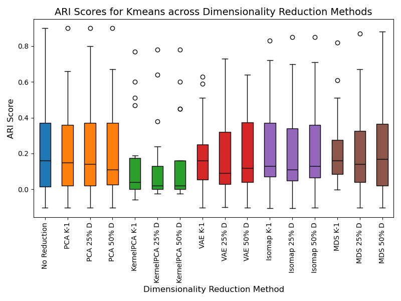
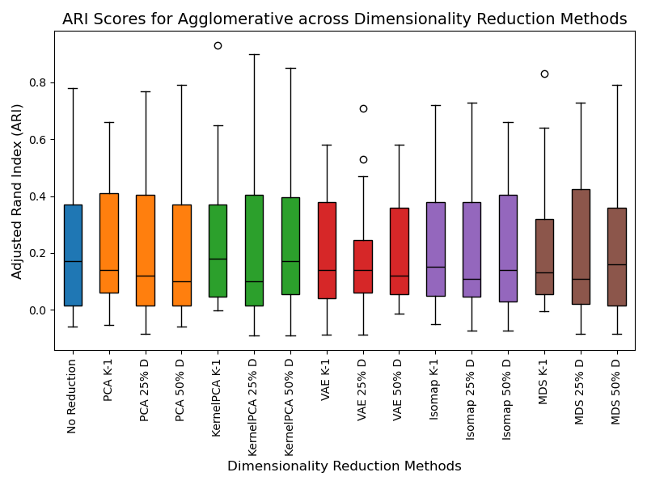
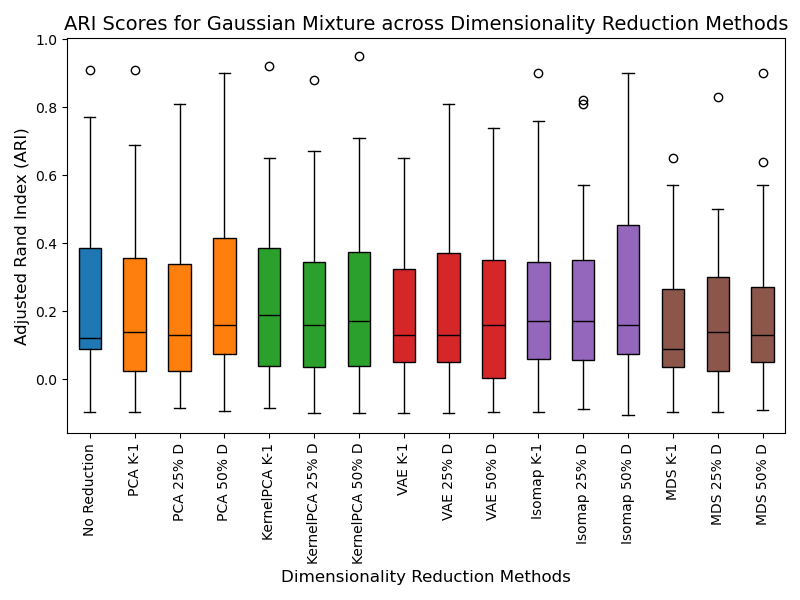

